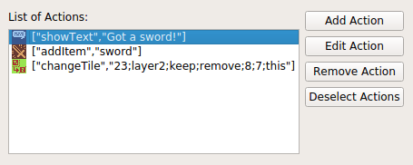
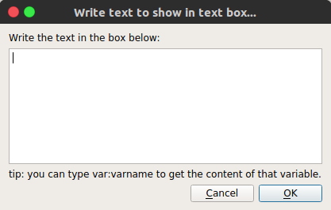
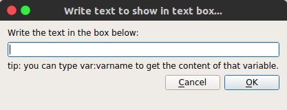
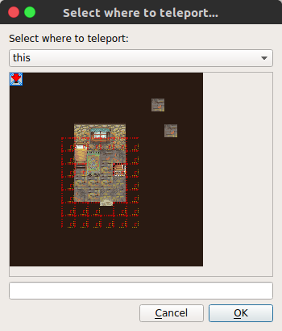
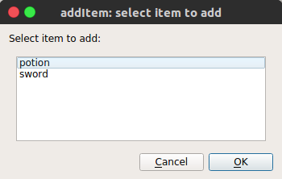
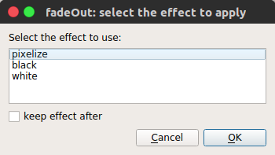
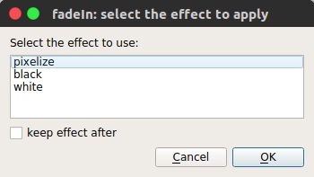
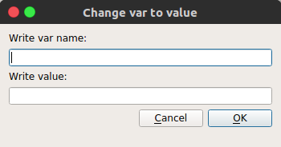
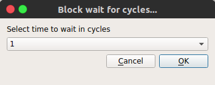
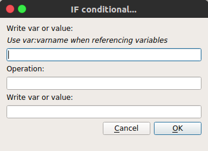

# Actions

Whenever something happens, what happens, are actions!

Actions are usually not alone, the is usually some list that has actions in a
certain order to be executed.

## How they work

When you are offered to list actions, it means something happened, perhaps the
player interacted with a Chara or an Event ("clicked"), perhaps he used an item,
or something else. The list of actions is a recipe of what will happen.

Clicking Add Action with no action selected will insert the new action after the
current list of actions. If any action is selected, clicking Add Action will
insert the new action above the selected action.

Actions are read from top to bottom, they are then placed in a FIFO buffer.
The IF action can interact with this buffer, which will change execution flow.

## Available Actions

### { width=16px } showText
Parameter: "text"

**showText** presents a text to the player and blocks, waiting for him to
interact. Currently it supports text wrapping and shows a word per time, and
plays a small noise for each word.

This is a very important part that can be a lot more complex than it seems, like
supporting multiple sounds, characters for pausing, auto skipping text and all,
which can give each conversation bigger depth. Right now, though, I have no
idea how to implement everything in a nice way.

### { width=16px } alert
Parameter: "text"

**alert** is a way to show quick texts, that doesn't require the player to
interact.

### { width=16px } teleport
Parameter:"positionx", "positiony", "level"

**teleport** enables moving in a single frame the player from anywhere in the screen to a defined position at a defined level and it's usually meant to be used in doors in a dungeon or town.

### { width=16px } teleportInPlace
Parameter: "level"

**teleportInPlace** enables moving in a single frame the player from a map to
another map, preserving the player exact position.

### { width=16px } addItem
Parameter: "item"

**addItem** adds an item to the player inventory.

### { width=16px } dropItem
Parameter: "item"

**dropItem** drops one item from the player inventory.

### { width=16px } changeTile
Parameter:"tileType","layer","colision","event",["positionx","positiony","level"]/["current"]

**changeTile** can change a tile from a type, to any other type and also change that tile event mark and remove or add colision. It can also target a specific position in a level or just the current tile that contains the event. It's a very powerful action and adds a lot of possibilities.

### { width=16px } changeAllTiles
Parameter: "tileType", "tileType", "layer", "colision", "event", "level"

**changeAllTiles** changes a single tile that has a type the chosen layer, for
another tile of different type. You can also set those tiles to a different
value of colision or event number.

### { width=16px } changePlayerAnimation
Parameter: "charaset_animation"

**changePlayerAnimation** changes the current player animation. You can set to
default to let animations flow as usual.

### { width=16px } rain
Parameter:"start/stop"

**rain** makes rain. You can stop the rain using stop.

### { width=16px } fadeOut
Parameter:"effect", "keepEffect"

**fadeOut** fades the screen using a effect and can optionally keep that effect,
usually when you want to do something in between and then play a fadeIn.

### { width=16px } fadeIn
Parameter:"effect", "keepEffect"

**fadeIn** is similar to fadeOut, but instead it's meant to bring the screen
back from a fadeOut.

### { width=16px } setVar
Parameter:"variable","value"

**setVar** allow to change a Variable to a specific value.
Value can be a number, a string or a *special string*.

Right now the only supported *special string* is "var:varname",
where varname should be changed to the name of a variable which
the value you want to pass to the Variable - the first parameter.

### { width=16px } varPlusOne
Parameter:"variable"

**varPlusOne** sums integer 1 on variable (var).

If variable doesn't exist, it creates it!

### { width=16px } waitCycle
Parameter:"int"

**waitCycle** blocks the player for a number of specified cycles.

### { width=16px } IF
Parameter:"condition"

**IF** condition is a special type of parameter, right now it must be in the
format "varOrValue1;oper;varOrValue2", where oper is the operator.

Possible operators:

- `>`,`bigger`,`greater`

- `<`,`smaller`,`less`

- `>=`

- `<=``

- `==`,`=`,`equal`

The field **var of value** can be either a value (like `1`, `42` or `house`), or
a variable. If it's a variable, the following variables available:

- `var:varname`, where `varname` is the name of a user defined variable.

- `ans:answer`, where `answer` is the answer of the last questionBox.

- `lastbattle:`, return True if the player won the last battle.

- `hero:face`, returns on of the following directions `up`,`down`,`left`,`right`.

- `hero:x`, returns the x position of the Hero in the map.

- `hero:y`, returns the y position of the Hero in the map.

- `map:this`, returns the name of the current map.

If the condition is met, this is, it evaluates to TRUE, then it runs whatever
code is next until ELSE or END action are met, and jumps to after the END.
If the condition is FALSE  then it ignores any actions until ELSE or END.

### { width=16px } ELSE
Parameter: ""

**ELSE** is to be used with IF action.

### { width=16px }  END
Parameter: ""

**END** is to be used with IF action.

### { width=16px }  noEffect
No parameter

This a placeholder, but it's meant to turn off all effects, like the ones from fadeIn and fadeOut.
