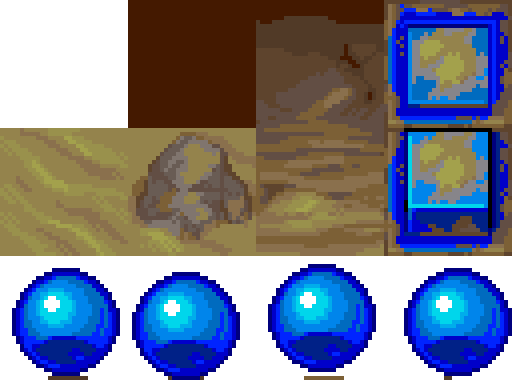
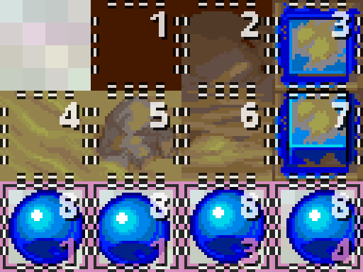

# Specification

The engine and the editor expects some files, and that they are organized in the
following manner.

Here is how the file tree should be  organized

    game_project_name
    ├── audio
    ├── descriptors
    │   ├── charaset
    │   │   └── charaset1.json
    │   ├── charas.json
    │   ├── feedback.json
    │   ├── hms.json
    │   ├── init.json
    │   ├── items.json
    │   └── levels
    │       ├── ahouse.map.json
    │       └── house.pal.json
    |        ...
    ├── font
    │   └── INFO56_0.ttf
    ├── icon.png
    ├── img
    │   ├── bgimg1.png
    │   ├── charaset.png
    │   ├── faceset.png
    │   ├── monsterset.png
    │   ├── pictures
    │   │   └── example.png
    |   |    ...
    │   ├── printer.png
    │   ├── sys
    │   │   ├── controllers.png
    │   │   ├── keys0.png
    │   │   ├── keysexplainer.png
    │   │   └── pckeys.png
    │   ├── tile.png
    │   └── title.png
    └── index.html

- `audio` (folder) - contains audio files used by the game.

- `descriptors` (folder) - contains all json files, and folders containing json
files.

    - `charaset` (folder) - this folder contains the different jsons that describes the
    animations you use with Charas.

    OBS: right now only a single file that has to be named `charaset1.json` is
    possible. Soon this won't be a requirement.

    - `charas.json` - things that you can place in any the map, they can move and
    trigger actions, and usually represent the non playable characters you interact
    in the game.

    - `feedback.json` - deals with the engine feedback, right now only colision and
    the sound when outputing text. This should be moved inside the engine soon.

    - `hms.json` - Heroes, Monsters and Skills, this file describes all the heroes
    that you can add to the party, all the monsters you can fight against, and the
    skills that they can have.

    - `init.json` - where does the game starts, who is in the party, and some things
    that didn't fit anywhere else.

    - `items.json` - has the description of the items, how do they work, what they
    are.

    - `scriptedbattles.json` - has the description of a scripted battle, what
    monsters are involved and how each script is triggered.

    - `levels` (folder) - this folder contains levels (.map.json files) and possible
    palettes (.pal.json files) to use when designing levels.

- `img` (folder) - this folder contains all the image files in png format.

    - `pictures` (folder) - you can show a picture using action, this folder
    contains possible pictures in png format.

- `font` (folder) - holds the type font for the engine. Currently it MUST be
INFO56_0.

  OBS: Soon the font name will be placed in init.json, so you will be able to
change this.

- `index.html` - this is the engine. It should be placed at the root of the
game project folder.

## .pal.json

A palette specifies how an image is going to be sliced in tiles to be available
for drawing maps. An image can be like below - note, the first 32x32 pixel tile
should always be empty.

This file holds a palette of tiles, it's used to "paint" maps, each tile in a
map layer (1,2 and 4) will be translated to a cropped piece of 32 pixels in width
and height from the image.

    {
        "tilesAnimated":
        {
            "8":
                 [[  0, 2],
                  [  1, 2],
                  [  2, 2],
                  [  3, 2]] },
        "tiles":
        {   "1":  [  1, 0],
            "2":  [  2, 0],
            "3":  [  3, 0],
            "4":  [  0, 1],
            "5":  [  1, 1],
            "6":  [  2, 1],
            "7":  [  3, 1],
            "8":  [  1, 2]  },
        "tileImage": "img/tile.png"
    }

*the image above represents the palette*

- `tileImage` : the relative path to a png image that is used by the palette.

- `tiles` : this contains a dictionary of numbers, and each number points to a
32x32 pixel piece of the image pointed by `tileImage`.
    - `tiles: "1" : [X,Y], "2" : [X,Y], ...`

- `tilesAnimated` : this contains a dictionary of numbers, and each number points
to a list that points a different 32x32 pixel piece of the image pointed by
`tileImage`, describing an animated tile.

## .map.json

Below is an example file with each field that is expected to be available. Each
numeric 2d matrix is of the same size, which is defined as map width and height.
The matrix is described as a list (y dimension) of lists (x dimension).

You can think of a map as having for layers, the **first** layer, named `layer1`
is drawn first, and **second** the `layer2` is drawn next, the `player` and
`charas` are drawn in the **third** layer where the `colision` takes place to,
and on top the fourth layer, `layer4`, is drawn.

    { "Level":
        { "charas":  [],
          "colision":
                [[]],
          "events":
                [[]],
          "eventsActions":
              { "1":
                  [["ACTIONNAME","PARAM1;PARAM2;..."],
                   ["ACTIONNAME","PARAM1;PARAM2;..."]],
                "2":
                  [["ACTIONNAME","PARAM1;PARAM2;..."]] },
          "eventsType":
              { "1":  [  1,  0],
                "2":  [  1,  0]},
          "layer1":
              [[]],
          "layer2":
              [[]],
          "layer4":
              [[]],
          "levelName": "very_simple_map",
          "tileImage": "img/tile.png",
          "tiles":
              { "1":  [ 11, 12],
                "2":  [  1,  1] },
          "tilesAnimated":
              { }
        }
    }

Each `.map.json` file has the keywork `Level` at top-level.

- `charas` : a list of the charas that should be placed in the map
and their x and y position.
  - `"charas": [["CHARANAME",X,Y],["CHARANAME",X,Y],...]` .

  - Example: `"charas": [["bear",12,7]]`

- `colision` : a 2d numeric matrix, where 0 represents floor and 1 represents
walls.

- `events` : a 2d numeric matrix, where 0 represents no event, and any other
number represents an event.

- `eventsActions` : a dictionary where each event is represented by a number and
each number contains a list of actions and parameters.

  - `"eventsActions": { "1":[["ACTIONNAME","PARAM1"], ["ACTIONNAME","PARAM1;PARAM2"]] }`

- `eventsType` : a dictionary where each event is represented by a number and
each number contains an array representing when the event is triggered.

    - possible triggers are:

        - onclick : means the event is triggered when the player is adjacent to the tile, and presses the interaction button.

            - this is represented by the list `[1,0]`

        - ontouch : means the event is triggered when the player character is on the same tile.

            - this is represented by the list `[0,1]`

        - ideally a simple list that could contain the `onclick` and `ontouch` words would be clearer.

- `layer1` : a 2d numeric matrix, where 0 represents a clear tile, and any other
number represents a tile that is going to be drawn.

- `layer2` : a 2d numeric matrix, where 0 represents a clear tile, and any other
number represents a tile that is going to be drawn.

- `layer4` : a 2d numeric matrix, where 0 represents a clear tile, and any other
number represents a tile that is going to be drawn on top of the first, second
and third layer.

- `levelName` : the name of the map.

  - Right now this needs to be the same as the map file name without the .map.json .

- `tileImage` : the relative path to a png image that is used by the palette.

- `tiles` : this contains a dictionary of numbers, and each number points to a
32x32 pixel piece of the image pointed by `tileImage`.
    - `tiles: "1" : [X,Y], "2" : [X,Y], ...`

- `tilesAnimated` : this contains a dictionary of numbers, and each number points
to a list that points a different 32x32 pixel piece of the image pointed by
`tileImage`, describing an animated tile.
